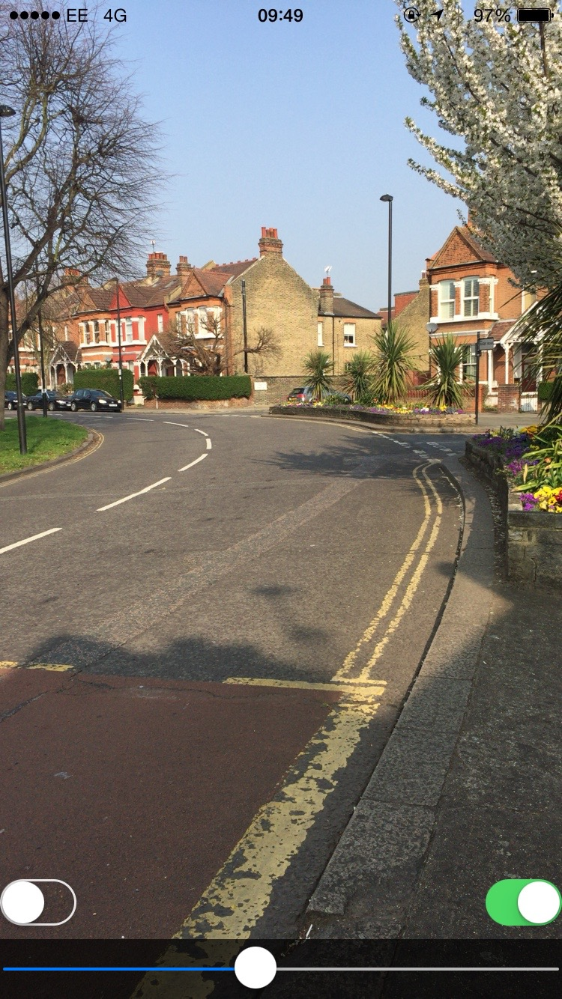
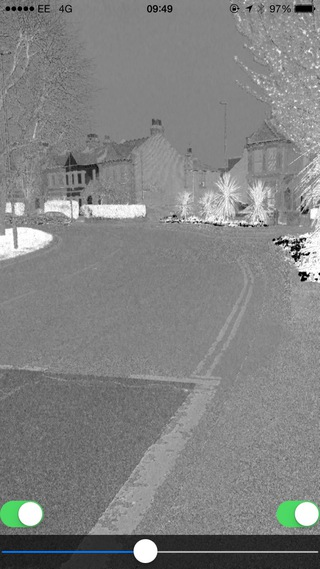

# Introduction

The paper [*Illumination Invariant Imaging: Applications in Robust Vision-based Localisation, Mapping and Classification for Autonomous Vehicles*](http://www.robots.ox.ac.uk/~mobile/Papers/2014ICRA_maddern.pdf) describes a technique for processing images into a 'colour invariant' state. This is done to improve image recognition accuracy in environments where lighting conditions can change the appearance of a scene dramatically.

This iOS project provides an implementation of the colour invariance transformation as a Metal shader. 

The project also contains an example application where the transformation is applied to an image, and, more excitingly, to the live camera video preview.

#Examples

Live video preview (full colour mode):

Live video preview (colour invariant mode):

Notice how most of the shadows are not identifiable in the colour invariant image.
